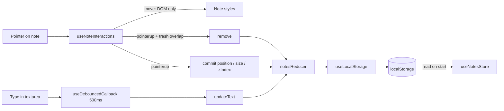

# React + TypeScript + Vite

# Preview https://mrredhand.github.io/StickyNotesB/

Basic notes workflow implementation

- Context is to communicate between notes
- useReducer for notes operations
- useLocalStorage hook to store data
- Store only on actions end - like drag end = store state
- Textarea input has debounce 500ms before store trigger

# To run - basic `npm i` => `npm run dev`

## Structure

`Note` is `memo`'d and reads only `dispatch`, not the notes array. During drag or resize the DOM updates immediately; React state and localStorage update after the gesture ends.
